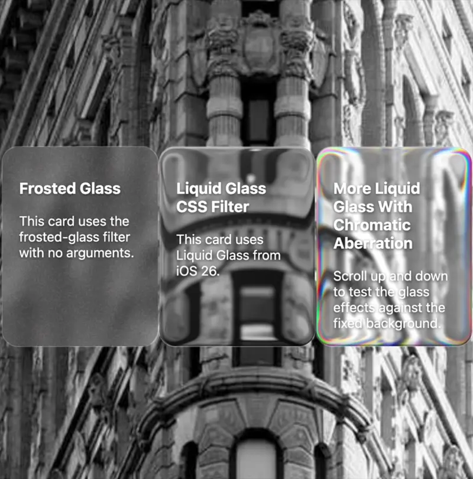

# FxFilterJS
A powerful JavaScript library that brings advanced visual effects to the web using SVG filters and canvas-based textures. Create stunning visual effects like liquid glass, frosted glass, chromatic aberration, and customizable noise patterns with simple CSS declarations. Easily extensible with custom effects using the FxFilter.add() API.

```html
<script src="https://berkaytumal.github.io/FxFilterJS/FxFilter.js"></script>
```

[View Demo](https://html-preview.github.io/?url=https://github.com/berkaytumal/FxFilterJS/blob/main/index.html)



## Usage

### CDN (Recommended)

```html
<!-- Latest version -->
<script src="https://berkaytumal.github.io/FxFilterJS/FxFilter.js"></script>

<!-- Specific version -->
<script src="https://berkaytumal.github.io/FxFilterJS/v1.0.0/FxFilter.js"></script>
```

### Local Installation

Download the script and include it directly in your HTML:

```html
<script src="FxFilter.js"></script>
```

### Basic Usage

After loading, apply effects using CSS custom properties:

```css
.element {
    --fx-filter: blur(10px) noise(.25, 1, .1);
}

.liquid-glass {
    --fx-filter: blur(2px) contrast(1.2) liquid-glass(2, 10) saturate(1.2);
}

.chromatic-glass {
    --fx-filter: blur(2px) liquid-glass(1.5, 8, 0.8) saturate(1.3);
}

.iridescent {
    --fx-filter: chromatic-aberration(1.0, 0.7) blur(1px);
}
```

## Available Effects

### Noise Effect
Creates customizable noise patterns for texture and grain effects.

```css
--fx-filter: noise(saturation, intensity, opacity);
```

**Parameters:**
- `saturation` (0-1): Controls color saturation (0 = grayscale, 1 = full color)
- `intensity` (0-1): Controls noise strength
- `opacity` (0-1): Controls noise transparency

**Examples:**
```css
/* Subtle grayscale noise */
--fx-filter: noise(0, 0.5, 0.1);

/* Colorful intense noise */
--fx-filter: noise(1, 1, 0.3);
```

### Liquid Glass Effect
Creates smooth, distorted liquid glass effects inspired by modern iOS design with optional chromatic aberration.

```css
--fx-filter: liquid-glass(refraction, offset, chromatic);
```

**Parameters:**
- `refraction`: Controls the liquid refraction intensity
- `offset`: Controls the size of rounded edges
- `chromatic` (optional): Controls chromatic aberration intensity (0-1)

**Examples:**
```css
/* Basic liquid glass */
--fx-filter: blur(2px) liquid-glass(2, 10) saturate(1.2);

/* Liquid glass with chromatic aberration */
--fx-filter: blur(2px) liquid-glass(1.5, 8, 0.8) saturate(1.3);
```

### Chromatic Aberration Effect
Creates rainbow color separation at edges, simulating light dispersion through prisms or optical glass.

```css
--fx-filter: chromatic-aberration(intensity, edge_falloff);
```

**Parameters:**
- `intensity` (0-2): Controls the strength of color separation
- `edge_falloff` (optional, 0-1): Controls how far from edges the effect extends

**Examples:**
```css
/* Subtle iridescent edges */
--fx-filter: chromatic-aberration(0.5, 0.8);

/* Strong prismatic effect */
--fx-filter: chromatic-aberration(1.5, 0.6) blur(3px);
```

## API (Advanced)

To extend FxFilterJS with custom effects:

```javascript
// Add a simple blur effect
FxFilter.add("custom-blur", (element, strength = 5) => {
    return `<feGaussianBlur stdDeviation="${strength}"/>`;
});

// Add a brightness effect
FxFilter.add("brightness", (element, value = 1.5) => {
    return `<feComponentTransfer>
        <feFuncA type="identity"/>
        <feFuncR type="linear" slope="${value}"/>
        <feFuncG type="linear" slope="${value}"/>
        <feFuncB type="linear" slope="${value}"/>
    </feComponentTransfer>`;
});

// Add a color matrix effect
FxFilter.add("sepia", (element, amount = 1) => {
    const matrix = `${0.393 * amount} ${0.769 * amount} ${0.189 * amount} 0 0
                    ${0.349 * amount} ${0.686 * amount} ${0.168 * amount} 0 0
                    ${0.272 * amount} ${0.534 * amount} ${0.131 * amount} 0 0
                    0 0 0 1 0`;
    return `<feColorMatrix type="matrix" values="${matrix}"/>`;
});

// Usage in CSS:
// --fx-filter: custom-blur(3) brightness(1.2) sepia(0.8);
```

## Example Usage

### Basic Frosted Glass Card
```css
.frosted-card {
    --fx-filter: blur(10px) noise(0, 1, 0.1);
    background: rgba(255, 255, 255, 0.1);
    border: 1px solid rgba(255, 255, 255, 0.2);
    border-radius: 20px;
    padding: 20px;
    backdrop-filter: blur(10px);
}
```

### Liquid Glass Element
```css
.liquid-glass {
    --fx-filter: blur(2px) contrast(1.2) liquid-glass(2, 10) saturate(1.2);
    background: linear-gradient(135deg,
        rgba(255, 255, 255, 0.25) 0%,
        rgba(255, 255, 255, 0.1) 50%,
        rgba(255, 255, 255, 0.05) 100%);
    box-shadow: 
        inset 0 2px 0 rgba(255, 255, 255, 0.3),
        inset 0 -2px 0 rgba(0, 0, 0, 0.3);
    border-radius: 20px;
    padding: 20px;
}
```

### Chromatic Glass Element
```css
.chromatic-glass {
    --fx-filter: blur(2px) liquid-glass(1.5, 8, 0.8) saturate(1.3);
    background: linear-gradient(135deg,
        rgba(255, 255, 255, 0.2) 0%,
        rgba(255, 255, 255, 0.05) 100%);
    box-shadow: 
        inset 0 2px 0 rgba(255, 255, 255, 0.3),
        inset 0 -2px 0 rgba(0, 0, 0, 0.3);
    border-radius: 20px;
    padding: 20px;
}
```

### Iridescent Effect
```css
.iridescent {
    --fx-filter: chromatic-aberration(1.0, 0.7) blur(1px);
    background: linear-gradient(135deg,
        rgba(255, 255, 255, 0.15) 0%,
        rgba(255, 255, 255, 0.05) 100%);
    border: 1px solid rgba(255, 255, 255, 0.2);
    border-radius: 15px;
    padding: 20px;
}
```

### Combining Multiple Effects
```css
.complex-effect {
    --fx-filter: blur(5px) noise(0.5, 0.8, 0.2) chromatic-aberration(0.8, 0.8) liquid-glass(1, 6, 0.4);
}
```

### Notes

- The prefix for all CSS variables is `--fx-filter`.
- Effects can be combined by chaining them in the CSS variable value.
- The library automatically processes elements with `--fx-filter` CSS variables.
- No need to call any methods for basic usage—just set the CSS variables on your element.

## Contributing

Contributions are most welcome! Feel free to submit issues and pull requests to help improve **FxFilterJS**.

1. Fork the repository.
2. Create a new branch for your feature or bugfix.
3. Submit a pull request when your code is ready.

## License

This project is licensed under the MIT License - see the [LICENSE](LICENSE) file for details.

## Contact

For any inquiries or feedback, feel free to reach out!

<a href="https://www.buymeacoffee.com/berkaytumal" target="_blank"></a>
